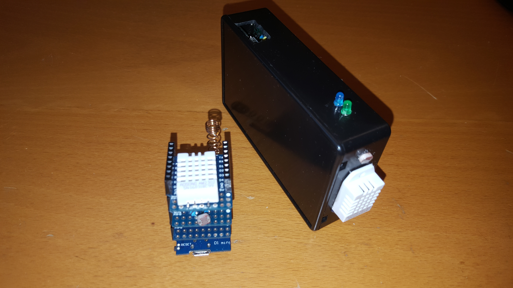
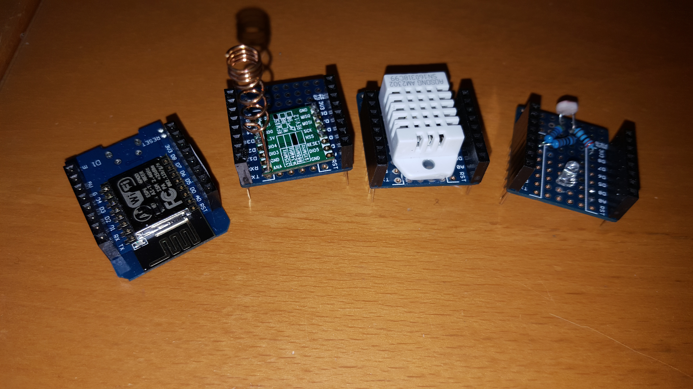
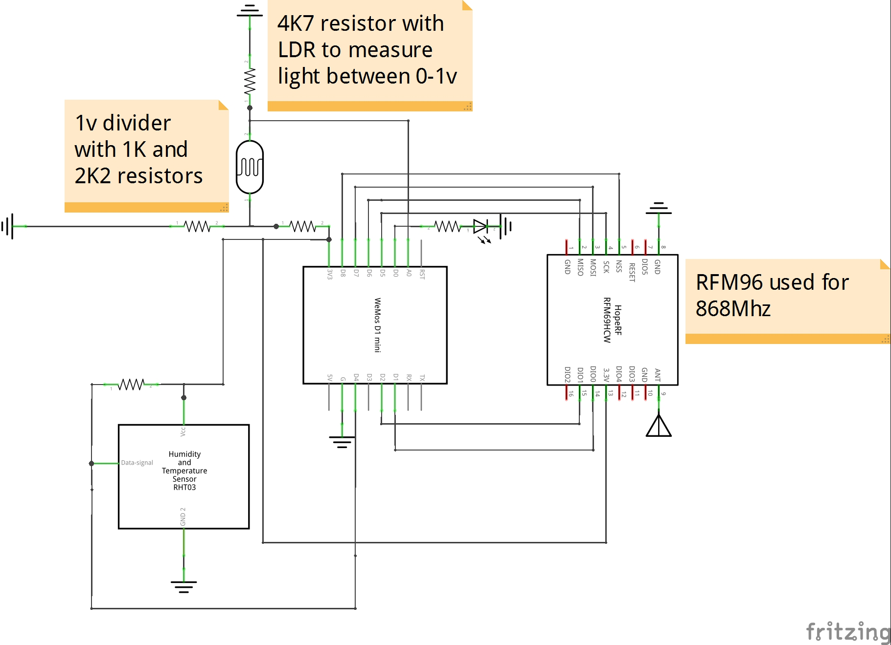
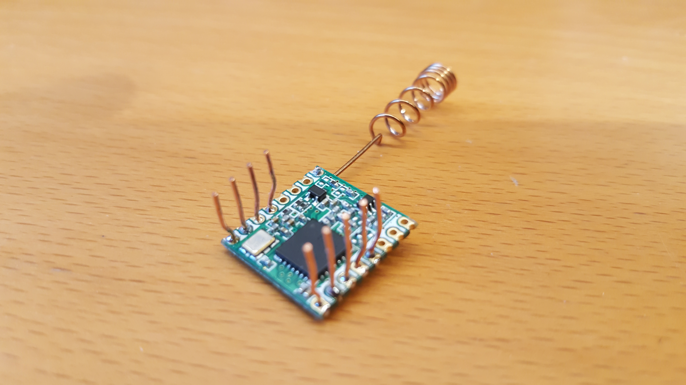
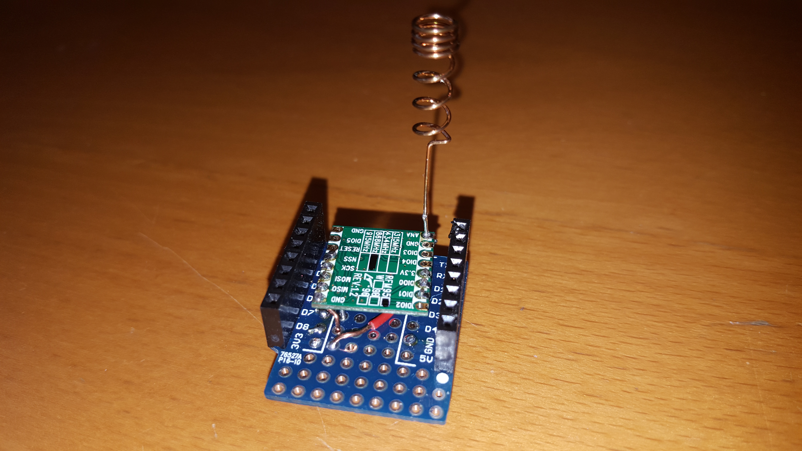

# LoRaWAN-ESP8266

Created by Mark Troyer  -  31 December 2016

Inspired by original code from Thomas Telkamp and Matthijs Kooijman  https://github.com/matthijskooijman/arduino-lmic/

## Introduction
This respository explains how to get started with LoRaWAN and The Things Network at a cost of under $50 using readily available parts.   The build consists of a LoRaWAN gateway and a simple node that senses temperature, humidity and light levels using The Things Network (thethingsnetwork.org) crowdfunded infrastructure.

The primary benefits of this build are as follows:

- Creation of an end-to-end applicaiton that leverages LoRaWAN technology and The Things Network infrastructure.
- A Bill of Materials of less that $50 for both a single-channel gateway and a node that senses temperature, humidity and light levels.
- An ideal starting point for hobbyists and professionals seeking to learn more about LoRaWAN and The Things Network.
- Uses the ESP8266 WiFi SoC (System on Chip) for primary microprocessor functions.
- Uses the Arduino IDE for simplified implementation.

In order to build the necessary two  devices, some basic soldering skills are required.  The total build time is around 3 hours.

### Limitations
*This project is built using a single channel LoRaWAN gateway. Strictly-speaking, this is out-of-spec.  LoRaWAN specifications require at minimum 3 channels.   In order to use a single channel gateway, all nodes must include software modifications to limit usage of the same single channel as the gateway.*   

As the pricing of LoRaWAN 8 channel gateways continues to fall in 2017, it is recommended to NOT use this type of implementation in the longer term.  For basic learning and demostrations, this configuraiton may prove to be helpful to further promote the benefits of LoRaWAN in general and The Things Network specifically.  For any form of a POC (Proof of concept), a proper 8 channel gateway should be used.

## Finished Product
There are two recommended ways to build these devices:  As enclosed devices or as WeMOS D1 Mini stacks.  Building enclosed devices has the benefit of ruggedness for transportation and demonstrations.  For those looking for a rapid prototyping environment, a WeMos D1 Mini stack build is recommended.  Custom shields can be quickly created and tested using a modular hardware approach.  



Below are the internals of an enclosed device used for regular demonstrations.  A simple project box and a prototyping breadboard allow for easy and quick assembly.   Hot glue always helps as well to keep things in place!


The WeMos D1 Mini Stack device offers the ability to quickly test new hardware concepts through the use of a breadboard or custom mini shields.  Seperate shields can me mixed and matched for different experiements. 




## Bill of Materials
All of the parts for these builds can be ordered through local electronics suppliers or directly though Chinese suppliers with Ebay, AliExpress or others.  Below is a Bill of Materials suggested for this project:

- Wemos D1 Mini (ESP8266) $3-5 - It is recommended to order 4 or 5 of these devices for all micro processor projects.  Even for devices that do not required WiFi, the ESP8266 price point can not be beaten.  
- Wemos D1 Mini Shields $2 - Order at least 10 of these for prototyping if you want to go this route.
- Prototyping breadboard $0.40 - Search for "double side prototype pcb tinned universal breadboard 5x7cm".  These are ideal and low cost Prototyping breadboards for any project built in a small box.  
- RFM95 at 868MHz $9-12 - This is the basic LoRa module with a Semtech tranciever chip.  Be sure to get the version appropriate for your region (e.g. 868 for Europe, 915 for North America and Australia).  If you are in the EC, Google "ebay RFM95 868" to see whats available.  Note that modules come preinstalled with the appropriate firmware for each frequency region.   Double check that you are ordering the appropriate product for your region.  It is best to order at least 3 in case one arrives DOA or you fry one accidently.
- DHT22 Temperature/Humidity Sensor $4 - Order at least 2-3 of these.
- Light-Dependent Resistor $0.50 - Normaly these come in lots of 20 or more.
- Resistors: 10K, 4K7, 2K2, 1K -  It is best to order an assortment of through hole resistors if you do not already have them on hand.
- 8.2cm wire antenna (nil) - I have used a coil copper antenna tuned for 868MHz.  Alternatively, an 8.2cm piece of wire will also work fine.

## Hardware Schematic
The hardware schematic for the build is below.   All pins on the ESP8266 except D3/GPIO 0 are used.   9 of the 16 pins on the RFM95 are used.  Ignore the references to the RFM69 and 96.   There is still learning to be done with E-CAD !



## Hardware build

If you are building the device using a WeMos D1 Mini stack design, it is recommended to create 3 seperate shields as follows:

- Shield for DHT22 Temperature/Humidity sensor.  These can also be purchased as finished shields or you can build your own.   If you build your own, it is important to us D4 (GPIO 02) for the signal with a 10K resistor pulled to 3.3v.   Note that D4/GPIO 02 on an ESP8266 should normally always be pulled high for normal and programming operation.   Therefore D4/GPIO 02 is the optimal pin to use for the DHT22.
- Shield for LED light and LDR.   The LED should be connected to D0 and ground.  It is very useful to have an addressable LED in firmware to indicate status of sending/receiving packets.  As the single ADC port on the ESP8266 only works between 0v and 1v, a voltage divider needs to be built using 2K2 (3.3v) and 1K (GND) resistors.  With the LDR (1v) and a 4K7 (GND) in place, a good range of digitally values between 0 and 512 will result.
- Shield for the RFM95.  This is the most complicated part of the build.  There are 9 pins on the RFM95 tranciever module that are required.  Unfortunaely, the pin holes on the RFM95 are 2mm apart where as typical prototyping breadboards are 2.54mm apart.  The result of this is that flexible core copper wire must be used to make the necessary connections to a prototyping breadboard or a header.  While not complex, assembly requires patients and forethought in terms of connections.  




Building enclosed devices can also be tricky.  Be to take your time and think through how connections will be made.   It is recommended to prototype assemblies first with single solder junctions or even a bit of hot glue to make sure all will fit together.  Desolding makes a mess!   You may need that extra RFM95 or WeMos board if you did not take the necessary time to plan your build.

## Software for Node build

There are two builds available for nodes.  The first works with ABP (Authentication by Personalization) using statically generated keys.   The second and recommended build works with OTAA (Over the Air Activation).  Note that constant work is being done on the https://github.com/matthijskooijman/arduino-lmic libraries and example code.   Over time, it may make more sense to retrofit some of the sensor code back into these libraries and examples.

## Software for single-channel LoRaWAN gateway build

Code for a single channel gateway can be found at https://github.com/things4u/ESP-1ch-Gateway-v3.0.   With the cost of 8 channel LoRaWAN gateways falling in 2017, it is recommended to try and use a proper gateway over time and not rely on single channel gateways.

Note that the hardware build in this example assumes the following mappings.
```
const lmic_pinmap lmic_pins = {
    .nss = 15, // D8
    .rxtx = LMIC_UNUSED_PIN,
    .rst = LMIC_UNUSED_PIN,
    .dio = {4, 5, LMIC_UNUSED_PIN},  // D1, D2
};
```

