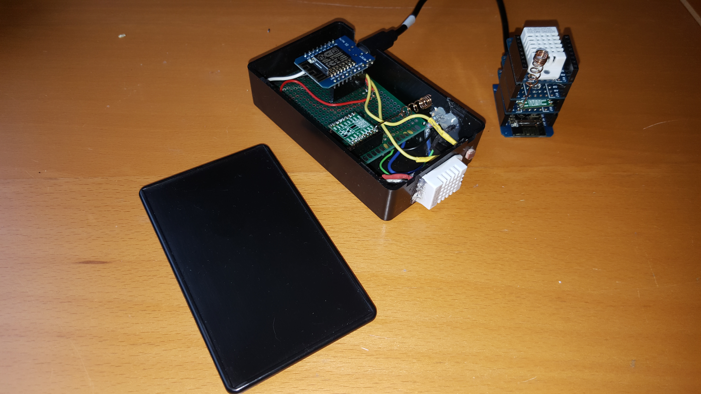
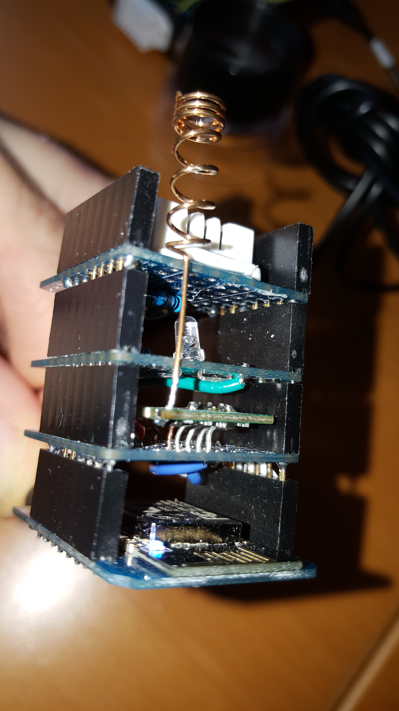

# LoRaWAN-ESP8266

Created by Mark Troyer  -  31 December 2016

Inspired by original code from Thomas Telkamp and Matthijs Kooijman  https://github.com/matthijskooijman/arduino-lmic/

# Introduction
This respository explains how to get started quickly with LoRaWAN and The Things Network at a cost of under $50 using readily available parts.   The build consists of a LoRaWAN gateway and a simple node that senses temperature, humidity and light levels using The Things Network (thethingsnetwork.org) crowdfunded infrastructure.

The primary benefits of this build are as follows:

- Creation of an end-to-end applicaiton that leverages LoRaWAN technology and The Things Network infrastructure.
- Bill of Materials of less that $50 for both a single-channel gateway and node that senses temperature, humidity and light levels.
- Ideal starting point for hobbyists and professionals seeking to learn more about LoRaWAN and The Things Network.
- Uses the ESP8266 WiFi SoC (System on Chip) for primary microprocessor functions
- Uses the Arduino IDE for simplified implementation

In order to build the necessary 2 devices, some basic soldering skills are required.  Total build time around 3 hours.

# Finished Product
There are two recommended ways to build these devices:  As an enclosed devices or as WeMOS D1 Mini stacks.  Building enclosed devices has the benefit of ruggedness for transportation and demonstrations.  For those looking for a rapid prototyping environment, a WeMos D1 Mini stack build is recommended.  Custom shields can be quickly created and tested using a modular hardware approach.

Below are the internals of an enclosed device used for regular travelling demostrations.  A simple project box and a prototyping breadboard allow for easy and quick assembly.  

The WeMos D1 Mini Stack device offers the ability to quickly test new hardware concepts through the use of a breadboard or custom shields.

Seperate shields can me mixed and matched for different experiements. 

# Bill of Materials
All of the parts for these builds can be ordered through local electronics suppliers or directly though Chinese suppliers with either Ebay or AliExpress. Delivery to Europe and the North Americs takes less than 15 days.  Below is a Bill of Materials for this build:

- Wemos D1 Mini (ESP8266) $3-5 - The new D1 Mini pro is more expensive but adds no additional value.
- Wemos D1 Mini Shields $2 - I recommend ordering at least 10 of these for prototyping if you want to go this route.
- Prototyping breadboard $0.40 - Search for "double side prototype pcb tinned universal breadboard 5x7cm".  Order at least 5 for future projects.
- RFM95 at 868MHz $9-12 - I order the basic modules.  It is best to order at least 3 in case one arrives DOA or you break on accidently.
- DHT22 Temperature/Humidity Sensor $4 - Order at least 2-3 of these.
- Light-Dependent Resistor $0.50 - Normaly these come in lots of 20 or more.
- Resistors: 10K, 4K7, 2K2, 1K $0.50 It is best to order an assortment of through hole resistors if you do not already have them on hand.
- 8.2cm wire antenna (nil) - I have used a coil copper antenna tuned for 868MHz.  Alternatively, an 8.2cm piece of wire will also work fine.

# Hardware Schematic
The hardware schematic for the build is below.   

# Hardware build

If you are building the device using a WeMos D1 Mini stack design, many of the devices connected to the WeMos process will need to be used on different proto shields.  If you are building a single channel TTN gateway, the LDR and temperature sensor can be ommited.   Keep the LED however so that you can see when LoRaWAN traffic is hitting your gateway.

# Software for Node

# Software for single-channel LoRaWAN gateway

Code for a single channel gateway can be found at https://github.com/things4u/ESP-1ch-Gateway-v3.0
